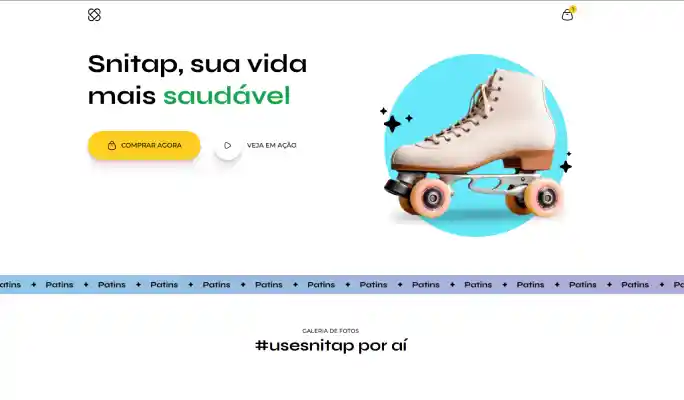
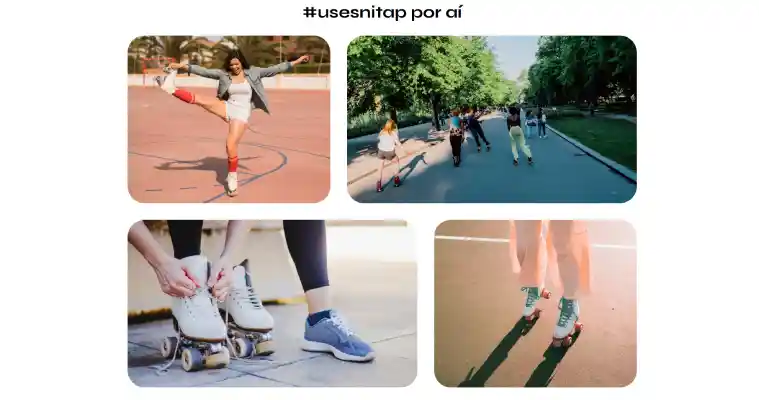

# LP - Patins

Responsive and animated HTML/CSS frontend that presents the skate as a sales product.

### development
* HTML
* CSS
* responsive

### Images | Link





* https://drlazinho.github.io/LP-Patins-animation/

### Getting Started

1. Clone the repository
```bash

git clone https://github.com/LP-Patins-animation

```
2. Open file index.html
